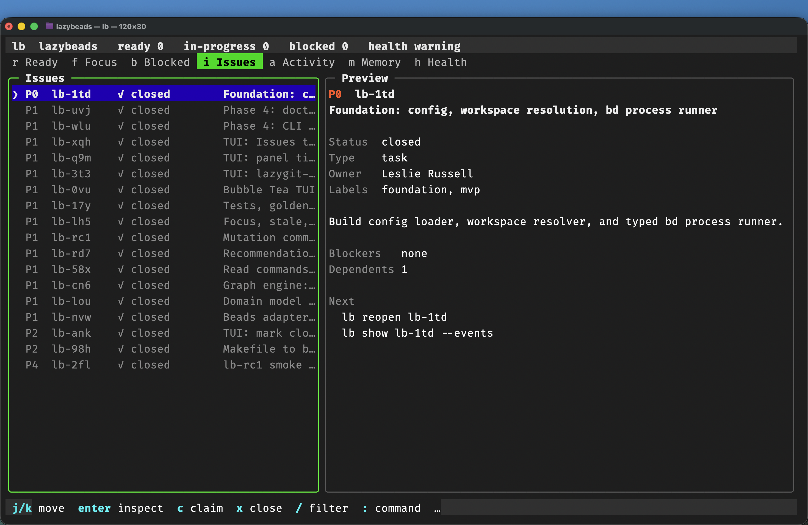

# LazyBeads

The terminal operator console for [Beads](https://github.com/gastownhall/beads).



`bd` is the database, graph, and atomic coordination layer. `lb` is attention management: rank, explain, navigate, and mutate through Beads' own interfaces — the `bd` CLI, the events journal and the `bd serve` HTTP API — never by writing `.beads/` itself.

```sh
make                 # bin/lb
make install         # ~/.local/bin/lb plus man page and shell completions
make install PREFIX=/usr/local   # system-wide; needs sudo
# or:
go install github.com/lesliesrussell/lazybeads/cmd/lb@latest
```

```sh
lb completion zsh    # print a completion script
man lb               # the lb(1) page, once installed
make man && man ./man/lb.1   # or render and read it from the source tree
```

The manual is embedded in the binary, so `lb man` prints it anywhere — including
from a downloaded release — and covers every command and flag, the configuration
schema, environment variables, exit codes, the JSON envelope, and the TUI keys.

Requires a Beads CLI (`bd`) on `PATH`, or `LB_BD_BIN`. Tested against Beads 1.0.x and 1.3.x; see [docs/compatibility.md](docs/compatibility.md).

## Quick start

```sh
cd ~/code/your-beads-project
lb doctor
lb status
lb next
lb claim <id> --yes
lb show <id>
lb close <id> --reason "done" --yes
```

On a real terminal, `lb` with no arguments launches the TUI. Otherwise it prints help and exits 2.

`lb doctor --fix` may write a user config file, create a cache directory, and install shell completion scripts. It never mutates Beads.

## Commands

| Area | Commands |
|---|---|
| Read | `status` `ready` `next` `show` `list` `search` `why` `graph` `blocked` |
| Mutate | `create` `edit` `claim` `unclaim` `close` `reopen` `assign` `dep` |
| Supervise | `focus` `stale` `activity` `memory` `sync status` `doctor` |
| UI | `tui` |

Every essential TUI action has a CLI equivalent. Mutations prompt on a TTY; non-interactive use requires `--yes`. `--dry-run` prints the `bd` argv and executes nothing.

## Live with Beads 1.3.0

Turn on the Beads events journal and the TUI and `lb status --watch` update themselves as agents change beads — no refresh key, no polling:

```sh
bd config set events-journal true
lb            # the header shows "● live"
```

LazyBeads keeps a local copy of the workspace fed by the journal, applying each change instead of re-running queries. In a workspace backed by a Dolt server it also starts and uses `bd serve`, Beads' HTTP API, for reads and writes. `lb doctor` shows what is in use; see [docs/architecture.md](docs/architecture.md).

JSON output is a stable envelope (`schema_version`, `command`, `workspace`, `data`, `warnings`, `generated_at`).

See [docs/](docs/) for architecture, configuration, keybindings, compatibility, and security.
